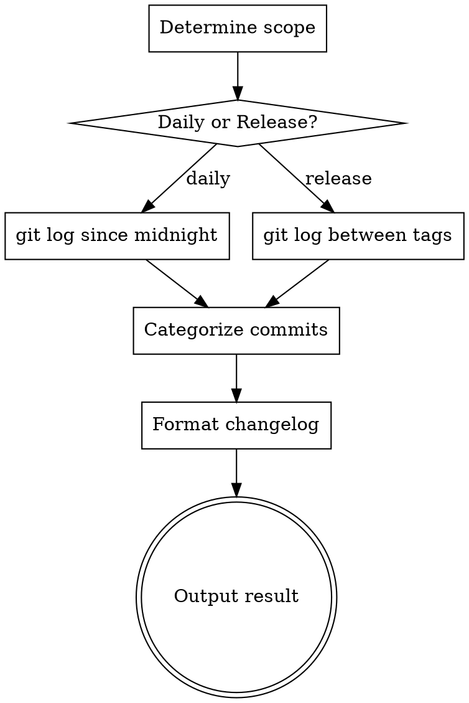

# Daily Changelog Generator

Generate structured changelogs from git history for the ShellMate project.

## Overview

This skill reads git commit history, categorizes changes, and produces a well-formatted changelog. It powers two workflows:
1. **Daily changelog** — summarize today's or recent changes
2. **Release changelog** — generate version release notes between tags

## When to Use

- User asks for a summary of recent git changes
- User wants to generate release notes before tagging
- User asks "what changed today/this week/since last release"
- Preparing a version tag and need changelog content

## Process



## Daily Changelog

### Step 1: Get today's commits

```bash
git log --since="$(date +%Y-%m-%d) 00:00:00" --pretty=format:"%h|%s|%an|%ad" --date=short
```

Or for a specific date range:
```bash
git log --since="2025-01-01" --until="2025-01-02" --pretty=format:"%h|%s|%an|%ad" --date=short
```

### Step 2: Categorize

Parse commit messages and group into categories:

| Prefix | Category |
|--------|----------|
| `feat:`, `add:` | ✨ Features |
| `fix:`, `patch:` | 🐛 Bug Fixes |
| `refactor:`, `clean:` | ♻️ Refactoring |
| `docs:`, `readme:` | 📝 Documentation |
| `test:`, `tests:` | 🧪 Tests |
| `ci:`, `build:`, `release:` | 🔧 CI/Build |
| `perf:`, `opt:` | ⚡ Performance |
| `chore:`, `style:`, `format:` | 🧹 Housekeeping |

Commits without a conventional prefix go into a **🔄 Other** category.

### Step 3: Format output

```markdown
## Changelog — {date}

### ✨ Features
- {short_hash} {message} ({author})

### 🐛 Bug Fixes
- {short_hash} {message} ({author})

...

**Total commits:** {count} | **Contributors:** {unique_authors}
```

## Release Changelog

### Step 1: Get commits since last tag

```bash
# Get the previous tag
PREV_TAG=$(git describe --tags --abbrev=0 HEAD^ 2>/dev/null || echo "")

if [ -n "$PREV_TAG" ]; then
    git log "${PREV_TAG}..HEAD" --pretty=format:"%h|%s|%an|%ad" --date=short
else
    git log --pretty=format:"%h|%s|%an|%ad" --date=short
fi
```

### Step 2: Get version info

```bash
VERSION=$(grep '^version =' Cargo.toml | head -1 | sed 's/.*"\(.*\)".*/\1/')
```

### Step 3: Format release notes

```markdown
## ShellMate v{version}

**Release Date:** {date}

### ✨ Features
- {message} ({short_hash})

### 🐛 Bug Fixes
- {message} ({short_hash})

...

**Full Changelog:** https://github.com/sorchk/shellmate/compare/{prev_tag}...v{version}
```

## Automation Notes

This skill is used by GitHub Actions in two workflows:
- `.github/workflows/changelog.yml` — runs daily at UTC 00:00, commits `CHANGELOG.md` updates
- `.github/workflows/release.yml` — generates release body from changelog on tag push

## MUST DO

- Always use `--pretty=format` for machine-parseable git output
- Include short hash in every entry for traceability
- Group by category, omit empty categories
- For release changelog, always include "Full Changelog" comparison link
- Read version from `Cargo.toml` as the single source of truth

## MUST NOT DO

- Do not include merge commits (use `--no-merges`)
- Do not fabricate changelog entries — only use actual git commits
- Do not modify `CHANGELOG.md` without user approval (except in CI)
